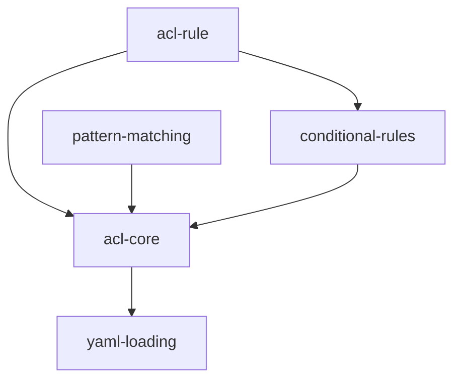

# Implementation Plan: ACL System

## Goal

Implement a pattern-based access control list that evaluates caller-to-target module permissions using first-match-wins semantics, supporting wildcard patterns, conditional rules, YAML-based configuration, and runtime rule mutation.

## Architecture Design

### Component Structure

- **ACL** (`acl.ts`, ~188 lines) -- Main access control class. Holds an ordered array of `ACLRule` objects and a `_defaultEffect` (default `'deny'`). Provides `check(callerId, targetId, context?)` for permission evaluation, `addRule(rule)` to prepend a rule, `removeRule(callers, targets)` to remove by JSON-stringified comparison, and `reload()` for hot-swapping YAML-loaded rules. Static `load(yamlPath)` factory parses and validates YAML configuration files.

- **ACLRule** (`acl.ts`) -- Interface defining a single access control rule: `callers` (string array of patterns), `targets` (string array of patterns), `effect` (`'allow'` or `'deny'`), `description` (string), and optional `conditions` record. Conditions are evaluated with AND logic across all present keys.

- **matchPattern** (`utils/pattern.ts`, ~30 lines) -- Standalone wildcard pattern matcher implementing Algorithm A08. Splits the pattern on `*` delimiters and verifies each segment appears in order within the module ID string. Handles edge cases: bare `*` matches everything, no `*` means exact match.

- **Error Types** (`errors.ts`) -- `ACLDeniedError` (raised by executor when `check()` returns `false`), `ACLRuleError` (invalid rule structure, bad YAML, missing keys), `ConfigNotFoundError` (YAML file does not exist). All extend `ModuleError` base class.

### Data Flow

The `check()` method evaluates permissions through this pipeline:

1. **Caller Normalization** -- `null` caller is replaced with `'@external'`
2. **Rule Snapshot** -- Shallow copy of `_rules` array (safe iteration)
3. **First-Match-Wins Scan** -- Iterate rules in order:
   a. **Caller Pattern Match** -- `rule.callers.some(p => _matchPattern(p, caller, context))`
   b. **Target Pattern Match** -- `rule.targets.some(p => _matchPattern(p, target, context))`
   c. **Condition Evaluation** -- If `rule.conditions != null`, apply `_checkConditions()`
   d. **Effect Return** -- If all checks pass, return `rule.effect === 'allow'`
4. **Default Effect** -- If no rule matches, return `_defaultEffect === 'allow'`

Pattern matching handles three special patterns:
- `'@external'` -- Exact match against the `@external` sentinel
- `'@system'` -- Checks `context.identity.type === 'system'`
- Wildcard patterns -- Delegated to `matchPattern()` from `utils/pattern.ts`

### Technical Choices and Rationale

- **First-match-wins over priority scores**: Simpler mental model; rule ordering in YAML is explicit and deterministic. No conflict resolution needed.
- **`JSON.stringify` for rule comparison in `removeRule()`**: Pragmatic approach for comparing string arrays without deep-equal dependencies. Suitable since callers/targets are always `string[]`.
- **No thread locking**: Node.js single-threaded event loop means no concurrent mutation of the rules array. The shallow copy in `check()` guards against mid-iteration `addRule`/`removeRule` calls from synchronous code, but no mutex is needed.
- **Synchronous YAML loading via `readFileSync`**: ACL configuration is loaded at startup or explicit reload. Synchronous I/O is appropriate for initialization-time config loading.
- **AND logic for conditions**: All present condition keys must pass for the rule to match. This provides a restrictive-by-default composition model (conditions narrow access rather than broaden it).
- **No debug logging**: Identified gap vs. Python implementation. The TypeScript ACL omits `debug` flag logging to keep the implementation lean. Can be added later via middleware or observability hooks.

## Task Breakdown

| Task ID | Title | Estimated Time | Dependencies |
|---------|-------|---------------|--------------|
| acl-rule | ACLRule interface definition | 1h | none |
| acl-core | ACL class with check, addRule, removeRule | 3h | acl-rule, pattern-matching, conditional-rules |
| pattern-matching | matchPattern() wildcard matching (Algorithm A08) | 2h | none |
| yaml-loading | ACL.load() from YAML, reload() support | 2h | acl-core |
| conditional-rules | _checkConditions() with identity_types, roles, max_call_depth | 2h | acl-rule |

## Risks and Considerations

- **Rule ordering sensitivity**: First-match-wins means a broadly-scoped rule placed early can shadow more specific rules. Documentation should emphasize that more specific rules should appear before general rules.
- **`JSON.stringify` ordering dependency**: `removeRule` relies on `JSON.stringify` producing identical output for identical arrays. This holds for simple `string[]` but would break for arrays containing objects with non-deterministic key order. Current usage is safe since callers/targets are always string arrays.
- **Synchronous file I/O in `load()`/`reload()`**: Blocks the event loop during YAML parsing. Acceptable for startup configuration but could be problematic if `reload()` is called frequently with large config files.
- **No validation of condition values at load time**: Condition values (e.g., `identity_types` expected as `string[]`) are validated at match time via type assertions, not at YAML load time. Malformed conditions will only surface when a rule is evaluated.
- **Debug flag exists but is unused**: The `debug` property is declared on the `ACL` class but no logging is wired up, representing a gap from the Python implementation.

## Acceptance Criteria

- [x] `ACLRule` interface defines callers, targets, effect, description, and optional conditions
- [x] `ACL.check()` implements first-match-wins evaluation returning `boolean`
- [x] Null caller is normalized to `'@external'`
- [x] `@system` pattern checks `context.identity.type === 'system'`
- [x] `matchPattern()` handles exact, wildcard, prefix, suffix, and multi-segment patterns
- [x] `ACL.load()` parses YAML, validates structure, and returns configured ACL instance
- [x] `reload()` re-reads YAML and replaces rules in-place; throws `ACLRuleError` if not loaded from YAML
- [x] `addRule()` prepends rules; `removeRule()` finds and removes by JSON-stringified caller/target match
- [x] Conditions (`identity_types`, `roles`, `max_call_depth`) are evaluated with AND logic
- [x] `ACLRuleError` thrown for invalid config structure; `ConfigNotFoundError` for missing YAML files
- [x] All tests pass with `vitest`; zero errors from `tsc --noEmit`

## References

- `src/acl.ts` -- ACL class and ACLRule interface
- `src/utils/pattern.ts` -- matchPattern wildcard utility
- `src/errors.ts` -- ACLDeniedError, ACLRuleError, ConfigNotFoundError
- `src/context.ts` -- Context and Identity types (consumed by ACL)
