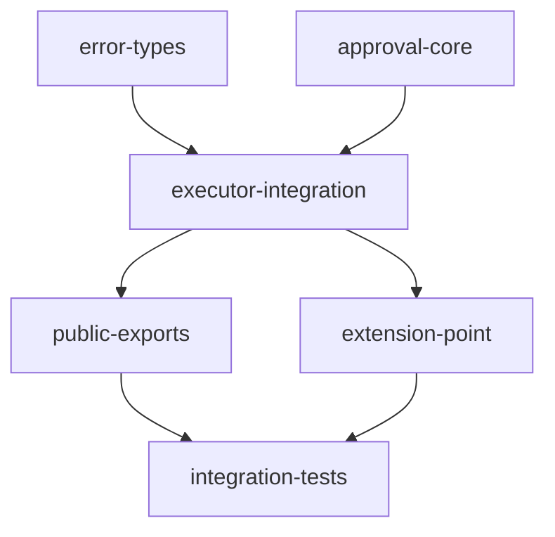

# Implementation Plan: Approval System

## Goal

Implement a runtime approval gate at Executor Step 4.5 (after ACL, before Input Validation) that enforces the `requiresApproval` annotation. Supports synchronous blocking approval (Phase A) and asynchronous pending-then-resume approval (Phase B) through an `ApprovalHandler` interface.

## Architecture Design

### Component Structure

The approval system spans four source files with six logical components:

- **`ApprovalHandler`** (`approval.ts`) -- TypeScript interface defining two async methods: `requestApproval(request) -> Promise<ApprovalResult>` and `checkApproval(approvalId) -> Promise<ApprovalResult>`. Handlers implement this interface to provide custom approval logic.

- **`ApprovalRequest` / `ApprovalResult`** (`approval.ts`) -- Frozen interfaces with `createApprovalRequest()` and `createApprovalResult()` factory functions using `Object.freeze()`. Request carries moduleId, arguments, context, annotations, description, and tags. Result carries status ("approved"/"rejected"/"timeout"/"pending"), approvedBy, reason, approvalId, and metadata.

- **Built-in Handlers** (`approval.ts`) -- `AlwaysDenyHandler` (always rejects), `AutoApproveHandler` (always approves), `CallbackApprovalHandler` (delegates to an async callback function).

- **Approval Errors** (`errors.ts`) -- `ApprovalError(ModuleError)` base with `ApprovalDeniedError`, `ApprovalTimeoutError`, `ApprovalPendingError`. Three new error codes: `APPROVAL_DENIED`, `APPROVAL_TIMEOUT`, `APPROVAL_PENDING`.

- **Executor Gate** (`executor.ts`) -- Step 4.5 inserted between ACL (Step 4) and Input Validation (Step 5). Private helpers: `_needsApproval()`, `_buildApprovalRequest()`, `_handleApprovalResult()`, `_emitApprovalEvent()`, `_checkApproval()`.

- **Extension Point** (`extensions.ts`) -- `approval_handler` registered as a non-multiple built-in extension point. Wired via `executor.setApprovalHandler()` in `apply()`.

### Data Flow

```
Executor.call() / callAsync() / stream()
  |
  +--> Step 4: ACL check
  |
  +--> Step 4.5: Approval Gate
  |      1. _needsApproval(module) -> boolean
  |         - Check annotations (ModuleAnnotations interface or Record<string, unknown>)
  |         - Return requiresApproval value
  |      2. If _approval_token in arguments:
  |         - Delete token from inputs, call handler.checkApproval(token)  [Phase B resume]
  |      3. Else:
  |         - Build ApprovalRequest from module + context
  |         - Call handler.requestApproval(request)                        [Phase A]
  |      4. _handleApprovalResult(result):
  |         - "approved" -> continue
  |         - "rejected" -> throw ApprovalDeniedError
  |         - "timeout"  -> throw ApprovalTimeoutError
  |         - "pending"  -> throw ApprovalPendingError (with approvalId)
  |         - unknown    -> console.warn, throw ApprovalDeniedError
  |
  +--> Step 5: Input Validation
```

### TypeScript-specific Adaptations from Python

- **Async-only execution**: TypeScript executor is async-only, so a single `_checkApproval()` method replaces Python's `_check_approval_sync()` + `_check_approval_async()` pair. No sync/async bridging needed.
- **Frozen objects via `Object.freeze()`**: Instead of Python's `@dataclass(frozen=True)`, factory functions wrap results in `Object.freeze()`.
- **Interface-based protocol**: TypeScript `interface ApprovalHandler` replaces Python's `@runtime_checkable Protocol`. Duck-typing type guard `isApprovalHandler()` used in `ExtensionManager`.
- **camelCase naming**: `requiresApproval`, `approvedBy`, `approvalId`, `moduleId` (vs Python's snake_case).
- **`result` typed as `unknown`**: Same circular-import avoidance as Python -- `ApprovalError.result` is `unknown` since `errors.ts` cannot import from `approval.ts`.

### Technical Choices

- **Optional handler (null default)**: When no handler is configured, the gate is completely skipped. This ensures 100% backward compatibility with existing code.
- **Dual annotation forms**: Both `ModuleAnnotations` interface and raw `Record<string, unknown>` are supported via property-in checks, since modules may use either form.
- **Unknown status defense**: Unrecognized status values trigger a `console.warn` and fall through to `ApprovalDeniedError` (fail-closed).
- **Audit events**: `console.info` for all decisions + span event appended to `_tracing_spans` when tracing is active (Level 3 conformance).

## Task Breakdown



| Task ID | Title | Estimated Time | Dependencies |
|---------|-------|---------------|--------------|
| error-types | Approval error classes and error codes | 0.5h | none |
| approval-core | ApprovalHandler interface, data types, built-in handlers | 1h | none |
| executor-integration | Approval gate at Step 4.5 in call/callAsync/stream | 2h | error-types, approval-core |
| public-exports | Export new types from index.ts | 0.5h | executor-integration |
| extension-point | approval_handler extension point in ExtensionManager | 1h | executor-integration |
| integration-tests | End-to-end tests through full executor pipeline | 2h | public-exports, extension-point |

## Risks and Considerations

- **Circular import avoidance**: `errors.ts` cannot import `ApprovalResult` from `approval.ts` (both imported by `executor.ts`), so `ApprovalError.result` is typed as `unknown`. Documented as acceptable tradeoff.
- **Annotation form divergence**: The dual-form handling (interface + dict) adds complexity but is necessary since the codebase supports both patterns (e.g., `FunctionModule` stores typed annotations, YAML bindings may produce dict form).

## Acceptance Criteria

- [x] `ApprovalHandler` interface with `requestApproval()` and `checkApproval()` async methods
- [x] `ApprovalRequest` and `ApprovalResult` frozen interfaces with factory functions
- [x] Three built-in handlers: `AlwaysDenyHandler`, `AutoApproveHandler`, `CallbackApprovalHandler`
- [x] Error hierarchy: `ApprovalError` base with three specific subclasses and error codes
- [x] Step 4.5 gate in `call()`, `callAsync()`, and `stream()` with correct ordering
- [x] Dual annotation form support (interface and dict)
- [x] Phase B `_approval_token` pop-and-resume flow
- [x] `approval_handler` extension point wired in `ExtensionManager.apply()`
- [x] Audit events emitted: `console.info` for all decisions + span event when tracing active
- [x] All 860 tests pass (793 existing + 67 new) with zero `tsc --noEmit` errors
- [x] Full backward compatibility: no handler = gate skipped

## References

- Source: `src/approval.ts`, `src/errors.ts`, `src/executor.ts`, `src/extensions.ts`
- Tests: `tests/test-approval.test.ts`, `tests/test-approval-executor.test.ts`, `tests/test-approval-integration.test.ts`
- Feature spec: [approval-system.md](../../docs/features/approval-system.md)
