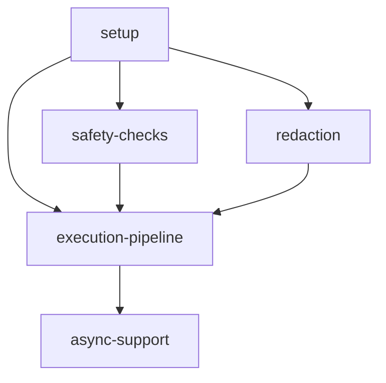

# Implementation Plan: Core Executor

## Goal

Implement the central 10-step execution pipeline that orchestrates all module calls in apcore, supporting context propagation, safety constraints, access control, schema validation with sensitive field redaction, middleware chains, and timeout-enforced module execution through a unified async code path.

## Architecture Design

### Component Structure

- **Executor** (`executor.ts`, ~300 lines) -- Main engine class implementing the 10-step pipeline. Accepts options object with `registry`, optional `middlewares` array, optional `acl`, and optional `config` at construction. Manages middleware registration via `MiddlewareManager`, configurable timeouts (default 30s, global 60s), max call depth (32), and max module repeat (3). Exposes `call()` (async) and `validate()` (pre-flight) entry points.

- **Context** (`context.ts`, ~60 lines) -- Class carrying per-call metadata: `traceId` (UUID v4 via `crypto.randomUUID()`), `callerId`, `callChain` (array of module IDs visited), `executor` reference, `identity`, `redactedInputs`, and a shared `data` record. Factory methods `create()` for root contexts and `child()` for nested calls. The `data` record is intentionally shared (not copied) between parent and child contexts to support middleware span/timing stacks.

- **Identity** (`context.ts`) -- Frozen interface representing the caller: `id`, `type` (default "user"), `roles` array, and `attrs` record. Created via `createIdentity()` factory with `Object.freeze()`.

- **Config** (`config.ts`, ~20 lines) -- Configuration accessor with dot-path key support (e.g., `executor.default_timeout`). Wraps a nested record and navigates through path segments.

- **Error Hierarchy** (`errors.ts`, ~280 lines) -- `ModuleError` base class with `timestamp`, `code`, `message`, `details` record, and `cause`. Specialized subclasses: `CallDepthExceededError`, `CircularCallError`, `CallFrequencyExceededError`, `ModuleNotFoundError`, `ACLDeniedError`, `SchemaValidationError`, `ModuleTimeoutError`, `InvalidInputError`.

### Data Flow

The 10-step pipeline processes every module call in this order:

1. **Context Creation** -- Build or derive `Context` via `create()` / `child()`
2. **Safety Checks** -- Call depth limit, circular detection (cycles >= 2), frequency throttling
3. **Module Lookup** -- `Registry.get()` with `ModuleNotFoundError` on miss
4. **ACL Enforcement** -- `ACL.check()` with `ACLDeniedError` on denial
5. **Input Validation** -- TypeBox `Value.Check()` + `redactSensitive()` for context logging
6. **Middleware Before** -- `MiddlewareManager.executeBefore()` with `MiddlewareChainError` handling
7. **Module Execution** -- Timeout via `Promise.race` with `setTimeout`
8. **Output Validation** -- TypeBox `Value.Check()` on return value
9. **Middleware After** -- `MiddlewareManager.executeAfter()` in reverse order
10. **Result Return** -- Return output record or propagate error with `onError` recovery

### Technical Choices and Rationale

- **`Promise.race` for timeout**: Simple and idiomatic for Node.js async timeout enforcement. The timeout promise rejects with `ModuleTimeoutError` if the execution exceeds the limit.
- **Unified async `call()`**: TypeScript's async-first model eliminates the need for separate sync/async code paths. All module executions go through `Promise.resolve()` which handles both sync and async return values transparently.
- **Shared `data` record in child contexts**: Enables middleware like tracing and metrics to maintain span stacks across nested module-to-module calls without additional plumbing.
- **`JSON.parse(JSON.stringify())` in `redactSensitive`**: Simple deep clone for JSON-compatible input data. Suitable since module inputs are expected to be JSON-serializable.

## Task Breakdown

| Task ID | Title | Estimated Time | Dependencies |
|---------|-------|---------------|--------------|
| setup | Context, Identity, and Config classes | 2h | none |
| safety-checks | Call depth, circular detection, frequency throttling | 3h | setup |
| execution-pipeline | 10-step async pipeline with middleware and timeout | 6h | setup, safety-checks, redaction |
| async-support | Unified async execution and Promise-based bridge | 4h | execution-pipeline |
| redaction | Sensitive field redaction utility | 2h | setup |

## Risks and Considerations

- **`setTimeout` timer leak**: The timeout timer is not cleaned up if execution completes before timeout. Harmless since the timer fires into a resolved promise, but wasteful.
- **Middleware error recovery**: If a middleware `before()` fails, previously executed middlewares must have their `onError()` called. The `MiddlewareChainError` wrapping captures which middlewares have been executed.
- **Circular detection strictness**: Only cycles of length >= 2 are detected (A calling B calling A), not self-recursion (A calling A), which is covered by frequency throttling.

## Acceptance Criteria

- [ ] All 10 pipeline steps are implemented and tested in isolation and end-to-end
- [ ] Timeout enforcement works via `Promise.race` with `setTimeout`
- [ ] Timeout of 0 disables enforcement with a logged warning
- [ ] Negative timeout raises `InvalidInputError`
- [ ] Safety checks correctly detect call depth violations, circular calls, and frequency throttling
- [ ] `redactSensitive` handles nested objects, arrays with `x-sensitive` items, and `_secret_`-prefixed keys
- [ ] Error recovery via `onError` returns recovery record or re-raises original exception
- [ ] `validate()` provides standalone pre-flight schema checks without execution
- [ ] All error types carry structured details with timestamps
- [ ] All tests pass with `vitest`; zero errors from `tsc --noEmit`

## References

- `src/executor.ts` -- Core execution engine
- `src/context.ts` -- Context and Identity classes
- `src/config.ts` -- Configuration accessor
- `src/errors.ts` -- Error hierarchy
- [Core Executor Feature Specification](../../features/core-executor.md)
