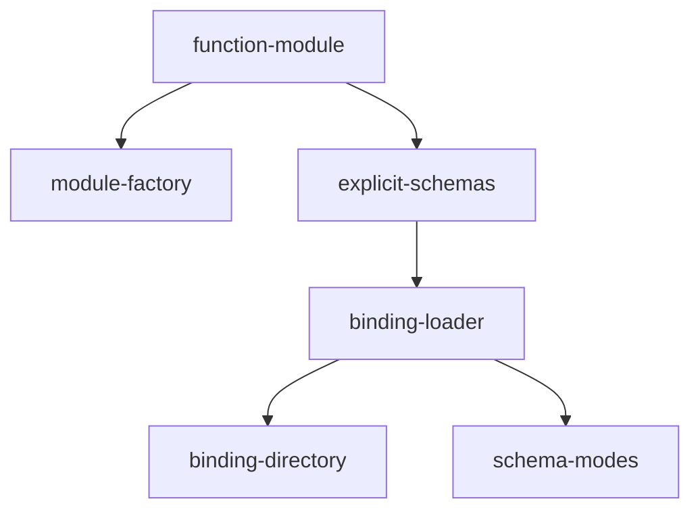

# Implementation Plan: Decorator Bindings

## Goal

Implement the TypeScript module definition and YAML binding system for apcore, providing a `FunctionModule` class that wraps execute functions with explicit TypeBox schemas, a `module()` factory for ergonomic module creation, and a `BindingLoader` for zero-code-modification module registration from YAML configuration files. Unlike the Python implementation, TypeScript cannot introspect types at runtime, so all schemas must be explicitly provided.

## Architecture Design

### Component Structure

- **FunctionModule** (`decorator.ts`, ~60 lines) -- Core wrapper class that associates an execute function with `inputSchema`/`outputSchema` (TypeBox `TSchema`), `description`, `documentation`, `tags`, `version`, `annotations`, `metadata`, and `examples`. The `execute()` method calls the wrapped function and passes the result through `normalizeResult()`. All optional fields default to sensible values (description defaults to `"Module {moduleId}"`, version to `"1.0.0"`, others to `null`).

- **normalizeResult()** (`decorator.ts`, ~4 lines) -- Exported utility that standardizes module return values: `null`/`undefined` becomes `{}`, plain `Record` objects pass through unchanged, and all other values (strings, numbers, booleans, arrays) are wrapped in `{ result: value }`. Exported (unlike Python where it is private) for use by `BindingLoader` and testing.

- **makeAutoId()** (`decorator.ts`, ~7 lines) -- ID generation utility that lowercases a name string, replaces non-alphanumeric/non-dot/non-underscore characters with underscores, and prefixes digit-leading segments. Simpler than Python's `__module__`+`__qualname__` approach since TypeScript functions lack equivalent introspectable qualified names.

- **module()** (`decorator.ts`, ~25 lines) -- Factory function that creates a `FunctionModule` from an options object. This is NOT a decorator (unlike Python's `@module`); it is a plain function call that returns a `FunctionModule`. Accepts optional `registry` for auto-registration. Generates an auto ID via `makeAutoId('anonymous')` when `id` is not provided.

- **BindingLoader** (`bindings.ts`, ~175 lines) -- YAML binding file loader that reads binding configuration, resolves `target` strings to callable functions via dynamic `import()`, builds schemas from JSON Schema definitions, and registers `FunctionModule` instances with a `Registry`. Supports target resolution for both exported functions (`module:funcName`) and class methods (`module:ClassName.methodName`). Schema resolution has three modes: inline `input_schema`/`output_schema`, external `schema_ref`, and permissive fallback.

- **Error Hierarchy** (`errors.ts`) -- Six binding-specific error classes extending `ModuleError`: `BindingInvalidTargetError`, `BindingModuleNotFoundError`, `BindingCallableNotFoundError`, `BindingNotCallableError`, `BindingSchemaMissingError`, `BindingFileInvalidError`.

### Data Flow

Module creation via `module()` factory:

1. Caller provides options object with `execute`, `inputSchema`, `outputSchema`, and optional metadata
2. `module()` resolves `moduleId` from `id` option or generates one via `makeAutoId('anonymous')`
3. `module()` constructs a `FunctionModule` with all provided options
4. If `registry` is provided, the module is registered via `registry.register()`
5. `FunctionModule.execute()` calls the wrapped function and passes the result through `normalizeResult()`

Module creation via YAML binding:

1. `BindingLoader.loadBindings()` reads and parses a YAML file containing a `bindings` array
2. For each binding entry, `resolveTarget()` dynamically imports the target module and resolves the callable
3. Schema is resolved via one of three modes: inline JSON Schema, external `schema_ref` file, or permissive fallback
4. A `FunctionModule` is constructed wrapping the resolved callable with the resolved schemas
5. The module is registered with the provided `Registry`

### Technical Choices and Rationale

- **Factory function instead of decorator**: TypeScript decorators (TC39 Stage 3) operate on class methods/fields, not standalone functions. A factory function is more natural for wrapping plain functions and aligns with TypeScript's functional composition patterns.

- **Explicit schemas required**: TypeScript types are erased at compile time. Unlike Python where `inspect.signature()` and type annotations can be read at runtime, TypeScript provides no runtime type metadata. Therefore, all schemas must be provided as TypeBox `TSchema` objects at the call site. This is the fundamental architectural difference from the Python implementation.

- **`normalizeResult()` exported**: Made public (unlike Python's private method) because `BindingLoader._createModuleFromBinding()` duplicates the normalization logic inline. The export enables both `FunctionModule.execute()` and future binding code to share the same normalization behavior. The duplication in `_createModuleFromBinding` is a known minor issue.

- **Async binding loading with sync file I/O**: `loadBindings()` and `loadBindingDir()` are `async` methods because target resolution uses dynamic `import()`, which is inherently asynchronous. However, YAML file reading uses `readFileSync` for simplicity since binding loading is a startup-time operation.

- **`JSON_SCHEMA_TYPE_MAP` dead code**: The `bindings.ts` file contains a `JSON_SCHEMA_TYPE_MAP` constant and `buildSchemaFromJsonSchema()` wrapper that delegates to `jsonSchemaToTypeBox()` from the schema system. The map is unused dead code from an earlier iteration and should be cleaned up.

## Task Breakdown

| Task ID | Title | Estimated Time | Dependencies |
|---------|-------|---------------|--------------|
| function-module | FunctionModule class with execute, schemas, normalizeResult() | 2h | none |
| module-factory | module() factory function with options object pattern | 2h | function-module |
| explicit-schemas | Explicit TypeBox schema passing | 1h | function-module |
| binding-loader | BindingLoader with async loadBindings() from YAML | 4h | explicit-schemas |
| binding-directory | loadBindingDir() for directory scanning | 2h | binding-loader |
| schema-modes | Schema resolution modes: inline, schema_ref, permissive | 3h | binding-loader |

## Risks and Considerations

- **`normalizeResult()` duplication**: The `_createModuleFromBinding()` method in `BindingLoader` duplicates the normalization logic inline rather than calling the exported `normalizeResult()`. This creates a maintenance risk if the normalization rules change. Should be refactored to use the shared utility.
- **Dead code**: `JSON_SCHEMA_TYPE_MAP` in `bindings.ts` is unreferenced dead code. It was superseded by `jsonSchemaToTypeBox()` from the schema system and should be removed in a cleanup pass.
- **Sync file I/O in async methods**: `readFileSync` is used inside async `loadBindings()`. This blocks the event loop during file reads. Acceptable for startup-time binding loading but would be problematic if called during request handling.
- **Target resolution security**: Dynamic `import()` in `resolveTarget()` can import arbitrary modules. There is no allowlist or sandboxing of target module paths. This is by design for flexibility but should be documented.
- **No schema validation of binding YAML structure**: The binding YAML structure (required keys like `module_id`, `target`) is validated via imperative checks rather than a formal schema. A YAML schema for binding files could improve error messages.

## Acceptance Criteria

- [x] `FunctionModule` wraps execute functions with explicit `inputSchema`/`outputSchema`
- [x] `FunctionModule.execute()` calls the wrapped function and normalizes the result
- [x] `normalizeResult()` handles null/undefined -> `{}`, Record -> passthrough, other -> `{ result: value }`
- [x] `makeAutoId()` generates valid module IDs from arbitrary strings
- [x] `module()` factory creates `FunctionModule` with all options forwarded
- [x] `module()` auto-registers with registry when `registry` option is provided
- [x] `module()` generates anonymous ID when `id` is not provided
- [x] `BindingLoader.loadBindings()` reads YAML and creates registered modules
- [x] `BindingLoader.resolveTarget()` resolves `module:funcName` and `module:Class.method` targets
- [x] `loadBindingDir()` scans directories for `*.binding.yaml` files
- [x] Schema resolution supports inline, schema_ref, and permissive fallback modes
- [x] All binding error types are thrown with correct error classes
- [x] All tests pass with `vitest`; zero errors from `tsc --noEmit`

## References

- `src/decorator.ts` -- FunctionModule, module(), normalizeResult(), makeAutoId()
- `src/bindings.ts` -- BindingLoader class
- `src/errors.ts` -- Binding error hierarchy
- `src/schema/loader.ts` -- jsonSchemaToTypeBox() used by binding schema resolution
- `tests/test-decorator.test.ts` -- FunctionModule and module() tests
- `tests/test-bindings.test.ts` -- BindingLoader tests
