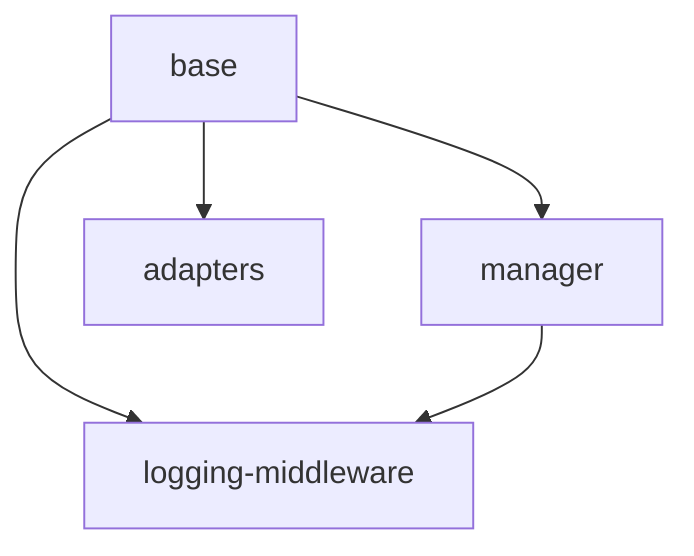

# Implementation Plan: Middleware System

## Goal

Implement a composable onion-model middleware pipeline that allows interception, transformation, and error recovery at each phase of a module call. The system provides a base class for subclassing, function adapters for lightweight usage, a manager for orchestration, and a built-in logging middleware with high-resolution timing.

## Architecture Design

### Component Structure

- **Middleware** (`middleware/base.ts`, ~30 lines) -- Abstract base class with three no-op lifecycle hooks: `before(moduleId, inputs, context)`, `after(moduleId, inputs, output, context)`, and `onError(moduleId, inputs, error, context)`. Each returns `Record<string, unknown> | null`; returning `null` signals "no transformation". Imports `Context` from the core context module.

- **MiddlewareManager** (`middleware/manager.ts`, ~100 lines) -- Onion-model execution engine. Maintains an internal `_middlewares` array with `add()`, `remove()` (by reference identity), and `snapshot()` (shallow copy). Exposes `executeBefore()` (forward order, returns `[transformedInputs, executedMiddlewares]` tuple), `executeAfter()` (reverse order), and `executeOnError()` (reverse over executed middlewares, first non-null recovery wins, errors in handlers are swallowed).

- **MiddlewareChainError** (`middleware/manager.ts`) -- Error subclass extending `ModuleError` (not `Exception` as in Python). Captures the `original` error and the `executedMiddlewares` array at the point of failure, enabling the executor to run `onError()` recovery on the correct subset of middlewares.

- **BeforeMiddleware / AfterMiddleware** (`middleware/adapters.ts`, ~55 lines) -- Adapter classes that wrap a single callback function (`BeforeCallback` or `AfterCallback` type alias) and delegate to the corresponding lifecycle hook. All other hooks remain no-op from the base class. Enables functional middleware patterns without subclassing.

- **LoggingMiddleware** (`middleware/logging.ts`, ~100 lines) -- Concrete middleware that logs structured messages at each phase via a pluggable `Logger` interface (`info` and `error` methods). Uses `performance.now()` for high-resolution timing stored on `context.data['_logging_mw_start']`. Supports configurable flags: `logInputs`, `logOutputs`, `logErrors` (all default `true`). Uses `context.redactedInputs` when available to avoid logging sensitive data.

- **Barrel Export** (`middleware/index.ts`) -- Re-exports all public classes, types, and interfaces.

### Data Flow

The middleware pipeline integrates into the executor's 10-step call sequence:

```
Inputs ──> [Before Phase: forward order] ──> Module Execution ──> [After Phase: reverse order] ──> Output
                                                    │
                                                    ▼ (on error)
                                              [OnError Phase: reverse over executed middlewares]
```

1. **Before Phase** -- `executeBefore()` iterates middlewares in registration order. Each `before()` can return transformed inputs or `null` (pass-through). If any middleware throws, a `MiddlewareChainError` is raised carrying the list of already-executed middlewares.

2. **After Phase** -- `executeAfter()` iterates middlewares in reverse registration order (onion unwinding). Each `after()` can return transformed output or `null` (pass-through).

3. **OnError Phase** -- `executeOnError()` iterates the `executedMiddlewares` list in reverse. The first middleware returning a non-null value provides the recovery result. Errors thrown inside `onError()` handlers are swallowed to prevent cascading failures.

### Technical Choices and Rationale

- **No thread locking**: Node.js runs on a single-threaded event loop. The Python implementation uses `threading.Lock` for middleware list mutations; this is unnecessary in TypeScript. The `snapshot()` method provides a stable copy for iteration, which is sufficient to guard against mutations during execution.

- **`MiddlewareChainError` extends `ModuleError`**: TypeScript uses `Error` (not `Exception` as in Python). `MiddlewareChainError` extends `ModuleError` to integrate with the framework's structured error hierarchy (code, details, timestamp). It carries `original: Error` and `executedMiddlewares: Middleware[]` for error recovery.

- **`performance.now()` for timing**: Provides sub-millisecond resolution timing available in Node.js 18+ without additional dependencies. The start timestamp is stored on `context.data` (shared between parent/child contexts) rather than middleware instance state, ensuring correct timing in concurrent call scenarios.

- **Synchronous lifecycle hooks**: All middleware hooks are synchronous. This is a deliberate design choice -- middleware should perform lightweight transformations and logging, not I/O. The executor wraps the entire pipeline in its async `call()` method.

- **Identity-based `remove()`**: Middleware removal uses strict reference equality (`===`), matching the Python implementation's `is` comparison. This ensures that only the exact instance is removed, not a structurally equivalent one.

## Task Breakdown



| Task ID | Title | Estimated Time | Dependencies |
|---------|-------|---------------|--------------|
| base | Middleware base class with no-op hooks | 1h | none |
| manager | MiddlewareManager with onion-model execution | 3h | base |
| adapters | BeforeMiddleware and AfterMiddleware adapters | 1.5h | base |
| logging-middleware | LoggingMiddleware with Logger and timing | 2h | base, manager |

## Risks and Considerations

- **Middleware ordering sensitivity**: The onion model means registration order directly affects behavior. Middlewares registered first run their `before()` first but their `after()` last. Users must understand this ordering to compose middleware correctly.
- **Error swallowing in `onError()`**: Errors thrown inside `onError()` handlers are silently swallowed. This prevents cascading failures but can hide bugs in error-recovery logic. Consider adding debug-level logging in the future.
- **`context.data` key collisions**: `LoggingMiddleware` writes to `context.data['_logging_mw_start']`. Other middlewares writing to the same key would corrupt timing. The `_logging_mw_` prefix is a convention to reduce collision risk, but there is no namespace enforcement.
- **No async middleware support**: If a use case requires async middleware (e.g., fetching external config before execution), the current synchronous design does not support it. This is an intentional trade-off for simplicity and performance.

## Acceptance Criteria

- [x] `Middleware` base class has `before()`, `after()`, `onError()` returning `null` by default
- [x] `MiddlewareManager.add()` appends and `remove()` removes by reference identity
- [x] `snapshot()` returns a shallow copy that does not affect the internal list
- [x] `executeBefore()` runs middlewares in forward order and returns `[inputs, executedMiddlewares]`
- [x] `executeAfter()` runs middlewares in reverse order
- [x] `executeOnError()` runs in reverse over executed middlewares; first non-null wins; errors in handlers are swallowed
- [x] `MiddlewareChainError` extends `ModuleError` with `original` and `executedMiddlewares` properties
- [x] `BeforeMiddleware` delegates only `before()` to the callback; other hooks remain no-op
- [x] `AfterMiddleware` delegates only `after()` to the callback; other hooks remain no-op
- [x] `LoggingMiddleware` logs START/END/ERROR with trace ID, module ID, and timing
- [x] `LoggingMiddleware` uses `performance.now()` for sub-millisecond duration measurement
- [x] `LoggingMiddleware` respects `logInputs`, `logOutputs`, `logErrors` configuration flags
- [x] `LoggingMiddleware` uses `context.redactedInputs` when available
- [x] All tests pass with `vitest`; zero errors from `tsc --noEmit`

## References

- `src/middleware/base.ts` -- Middleware base class
- `src/middleware/manager.ts` -- MiddlewareManager and MiddlewareChainError
- `src/middleware/adapters.ts` -- BeforeMiddleware, AfterMiddleware, and callback types
- `src/middleware/logging.ts` -- LoggingMiddleware and Logger interface
- `src/middleware/index.ts` -- Barrel export
- `src/errors.ts` -- ModuleError base class
- `tests/test-middleware.test.ts` -- Base class and adapter tests
- `tests/test-middleware-manager.test.ts` -- Manager and MiddlewareChainError tests
