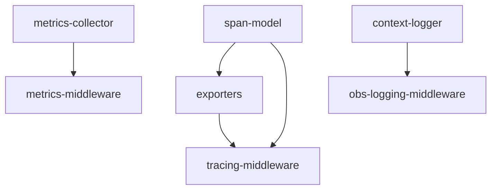

# Implementation Plan: Observability

## Goal

Implement the three pillars of observability -- tracing, metrics, and logging -- as middleware-integrated components that provide runtime visibility into the apcore execution pipeline. Each pillar operates through a `Middleware` subclass that uses stack-based state in the shared `context.data` record to handle nested module-to-module calls correctly.

## Architecture Design

### Component Structure

The observability module is organized into three source files, each housing one pillar and its associated middleware:

- **Tracing** (`observability/tracing.ts`, ~190 lines) -- `Span` interface describing a trace span with `traceId`, `spanId`, `parentSpanId`, timing, status, attributes, and events. `createSpan()` factory function generates spans with `randomBytes(8).toString('hex')` for span IDs. `SpanExporter` interface with two implementations: `StdoutExporter` (JSON.stringify to console.log) and `InMemoryExporter` (bounded array, shift()-based eviction, configurable max 10,000). `TracingMiddleware` extends `Middleware` with stack-based span management and 4 sampling strategies.

- **Metrics** (`observability/metrics.ts`, ~210 lines) -- `MetricsCollector` class with counter (`increment`) and histogram (`observe`) primitives. Uses string-encoded composite keys in the format `name|key1=val1,key2=val2` stored in `Map<string, number>`. No thread locking required (Node.js single-threaded). Histogram support with configurable buckets (13 Prometheus-standard defaults), `+Inf` bucket, and full Prometheus text format export. Convenience methods `incrementCalls()`, `incrementErrors()`, `observeDuration()` for apcore-standard metrics. `MetricsMiddleware` extends `Middleware` with stack-based `performance.now()` timing.

- **Logging** (`observability/context-logger.ts`, ~200 lines) -- `ContextLogger` class with 6 log levels (trace/debug/info/warn/error/fatal mapped to numeric values 0-50), JSON and text output formats, automatic `_secret_`-prefixed key redaction, and `fromContext()` static factory that binds trace ID, module ID, and caller ID. Output targets a `WritableOutput` interface (defaults to `process.stderr`). `ObsLoggingMiddleware` extends `Middleware` with stack-based timing and configurable input/output logging.

### Three Pillars Architecture

```
                    Executor Pipeline
                         |
          +--------------+--------------+
          |              |              |
   TracingMiddleware  MetricsMiddleware  ObsLoggingMiddleware
          |              |              |
     SpanExporter   MetricsCollector   ContextLogger
     /        \          |              |
StdoutExp  InMemoryExp  Prometheus    JSON/Text
                        Export        Output
```

### Data Flow

Each middleware hooks into the executor pipeline at three points: `before()`, `after()`, and `onError()`. State is carried across nested calls via the shared `context.data` record using reserved keys:

1. **TracingMiddleware** stores a span stack at `context.data['_tracing_spans']` and a sampling decision at `context.data['_tracing_sampled']`. On `before()`, a new span is created and pushed onto the stack with the current top-of-stack span as parent. On `after()`/`onError()`, the span is popped, finalized with end time and status, and conditionally exported based on the sampling decision.

2. **MetricsMiddleware** stores a timing stack at `context.data['_metrics_starts']`. On `before()`, `performance.now()` is pushed. On `after()`/`onError()`, the start time is popped and duration computed as `(performance.now() - startTime) / 1000` (converted to seconds for Prometheus conventions).

3. **ObsLoggingMiddleware** stores a timing stack at `context.data['_obs_logging_starts']`. On `before()`, `performance.now()` is pushed and a "Module call started" log entry is emitted. On `after()`, the start time is popped, duration computed in milliseconds, and "Module call completed" is emitted. On `onError()`, "Module call failed" is emitted with error details.

### Technical Choices and Rationale

- **`performance.now()` for timing**: Provides monotonic millisecond resolution. Unlike `Date.now()`, it is not affected by system clock adjustments. Unlike Python's `time.time()` (wall-clock seconds), this returns monotonic milliseconds, so MetricsMiddleware divides by 1000 for Prometheus-standard seconds.

- **String-encoded composite keys**: `MetricsCollector` stores counters and histogram data using keys in the format `name|key1=val1,key2=val2`. This avoids the overhead of nested Maps or object hashing and allows simple Map lookups. Labels are sorted alphabetically for deterministic key generation.

- **No thread locking**: Node.js runs JavaScript on a single thread. Unlike the Python implementation which requires threading locks for metric state, no synchronization primitives are needed here.

- **`randomBytes(8).toString('hex')` for span IDs**: Produces 16-character hex strings (64 bits of entropy). Uses Node.js `node:crypto` for cryptographic randomness rather than `crypto.randomUUID().slice(0,16)` to avoid partial UUID collisions.

- **Bounded array with `shift()` for InMemoryExporter**: Simple FIFO eviction. Python uses `collections.deque(maxlen=...)` which is O(1) for left-pop; JavaScript `Array.shift()` is O(n) but acceptable for the expected span volumes. A ring buffer could be a future optimization.

- **No OTel bridge**: An `OTLPExporter` is not yet implemented. The `SpanExporter` interface is designed to be compatible with future OpenTelemetry integration, but no OTel SDK dependency exists today.

- **`WritableOutput` interface for logger**: Abstracts the output target to support both `process.stderr` (default) and test buffers. Avoids coupling to Node.js streams directly.

## Task Breakdown



| Task ID | Title | Estimated Time | Dependencies |
|---------|-------|---------------|--------------|
| span-model | Span interface and createSpan() factory | 1h | none |
| exporters | StdoutExporter and InMemoryExporter | 1.5h | span-model |
| tracing-middleware | TracingMiddleware with sampling strategies | 3h | span-model, exporters |
| metrics-collector | MetricsCollector with Prometheus export | 3h | none |
| metrics-middleware | MetricsMiddleware with stack-based timing | 2h | metrics-collector |
| context-logger | ContextLogger with formats and redaction | 2h | none |
| obs-logging-middleware | ObsLoggingMiddleware with structured logging | 2h | context-logger |

## Risks and Considerations

- **`Array.shift()` performance in InMemoryExporter**: Eviction via `shift()` is O(n) per call when the buffer is full. For high-throughput tracing with maxSpans in the thousands, this is acceptable. If maxSpans grows to tens of thousands, consider a ring buffer implementation.
- **Missing OTLPExporter**: Production deployments expecting OpenTelemetry Protocol export will need a custom `SpanExporter` implementation or a future `OTLPExporter` addition. The `SpanExporter` interface is stable and ready for this extension.
- **Prometheus export is in-memory only**: `MetricsCollector.exportPrometheus()` generates text on demand. There is no HTTP endpoint or push gateway integration. Consumers must call `exportPrometheus()` and serve or ship the output themselves.
- **Sampling decision propagation**: The `_tracing_sampled` flag is set once per context (on first `before()` call) and inherited by all nested spans. This means proportional sampling is all-or-nothing per trace, not per span. The `error_first` strategy overrides this by always exporting error spans regardless of the sampling decision.
- **Logger output blocking**: `process.stderr.write()` is synchronous for small payloads on most platforms. High-volume logging could introduce backpressure in latency-sensitive paths.

## Acceptance Criteria

- [x] `Span` interface defines all required fields (traceId, spanId, parentSpanId, name, startTime, endTime, status, attributes, events)
- [x] `createSpan()` generates unique 16-hex-char span IDs via `randomBytes(8).toString('hex')`
- [x] `StdoutExporter` serializes spans via `JSON.stringify` to `console.log`
- [x] `InMemoryExporter` respects `maxSpans` limit with FIFO eviction via `shift()`
- [x] `InMemoryExporter.getSpans()` returns a defensive copy (spread into new array)
- [x] `TracingMiddleware` supports all 4 sampling strategies: full, proportional, error_first, off
- [x] `TracingMiddleware` validates sampling rate (0.0-1.0) and strategy on construction
- [x] Nested spans correctly chain via `parentSpanId` using stack-based management
- [x] `error_first` strategy always exports error spans even when not sampled
- [x] `MetricsCollector` supports counter increment and histogram observe operations
- [x] String-encoded keys use sorted labels for deterministic composite key generation
- [x] `exportPrometheus()` produces valid Prometheus text format with HELP, TYPE, buckets, sum, count
- [x] `MetricsMiddleware` records calls, errors, and duration via stack-based timing
- [x] Duration is converted from milliseconds to seconds for Prometheus conventions
- [x] `ContextLogger` supports JSON and text output formats with level filtering
- [x] `_secret_`-prefixed keys are automatically redacted to `***REDACTED***`
- [x] `fromContext()` binds traceId, moduleId, and callerId from a `Context` instance
- [x] `ObsLoggingMiddleware` emits structured start/complete/error log entries with timing
- [x] All tests pass with `vitest`; zero errors from `tsc --noEmit`

## References

- `src/observability/tracing.ts` -- Span model, exporters, and TracingMiddleware
- `src/observability/metrics.ts` -- MetricsCollector and MetricsMiddleware
- `src/observability/context-logger.ts` -- ContextLogger and ObsLoggingMiddleware
- `src/observability/index.ts` -- Public API barrel exports
- `tests/observability/test-tracing.test.ts` -- Tracing tests
- `tests/observability/test-metrics.test.ts` -- Metrics tests
- `tests/observability/test-context-logger.test.ts` -- Logger tests
