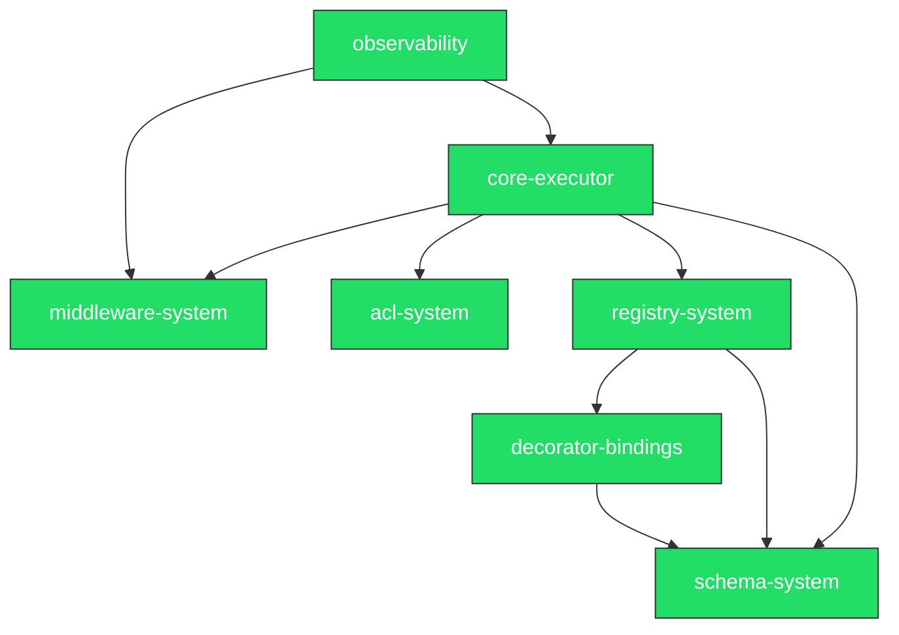

# apcore-typescript - Implementation Overview

## Overall Progress

```
[████████████████████████████████████████] 42/42 tasks (100%)
```

| Status | Count |
|--------|-------|
| Completed | 7 modules |
| In Progress | 0 modules |
| Pending | 0 modules |

## Module Overview

| # | Module | Description | Status | Progress |
|---|--------|-------------|--------|----------|
| 1 | [core-executor](./core-executor/) | Central orchestration: 10-step execution pipeline with context, safety checks, ACL, and middleware chains | completed | 5/5 |
| 2 | [schema-system](./schema-system/) | Schema loading, $ref resolution, TypeBox model generation, validation, and LLM provider format export | completed | 7/7 |
| 3 | [registry-system](./registry-system/) | Module discovery, registration, and querying with 8-step pipeline and topological dependency sort | completed | 8/8 |
| 4 | [middleware-system](./middleware-system/) | Composable onion-model middleware with before/after/on_error phases | completed | 4/4 |
| 5 | [acl-system](./acl-system/) | Pattern-based ACL with first-match-wins evaluation and conditional rules | completed | 5/5 |
| 6 | [observability](./observability/) | Distributed tracing, metrics collection, and structured logging middleware | completed | 7/7 |
| 7 | [decorator-bindings](./decorator-bindings/) | module() factory for code-first and BindingLoader for YAML-driven module registration | completed | 6/6 |

## Module Dependencies



## Recommended Implementation Order

### Phase 1: Foundation (Why first: no dependencies on other modules)

| Module | Rationale |
|--------|-----------|
| [schema-system](./schema-system/) | Core type definitions and validation used by all other modules |
| [middleware-system](./middleware-system/) | Base middleware infrastructure needed by executor and observability |
| [acl-system](./acl-system/) | Standalone access control with no internal dependencies |

### Phase 2: Core (Why next: depends only on Phase 1 modules)

| Module | Rationale |
|--------|-----------|
| [decorator-bindings](./decorator-bindings/) | Depends on schema-system for TypeBox schema generation |
| [registry-system](./registry-system/) | Depends on schema-system and decorator-bindings for module discovery |

### Phase 3: Orchestration (Why next: integrates all previous modules)

| Module | Rationale |
|--------|-----------|
| [core-executor](./core-executor/) | Depends on schema-system, middleware-system, acl-system, and registry-system |

### Phase 4: Cross-Cutting (Why last: enhances existing modules without changing behavior)

| Module | Rationale |
|--------|-----------|
| [observability](./observability/) | Depends on middleware-system and core-executor; adds tracing/metrics/logging |

---

*Generated by [code-forge](https://github.com/tercel/code-forge) | Source: [planning/features/](../features/)*
