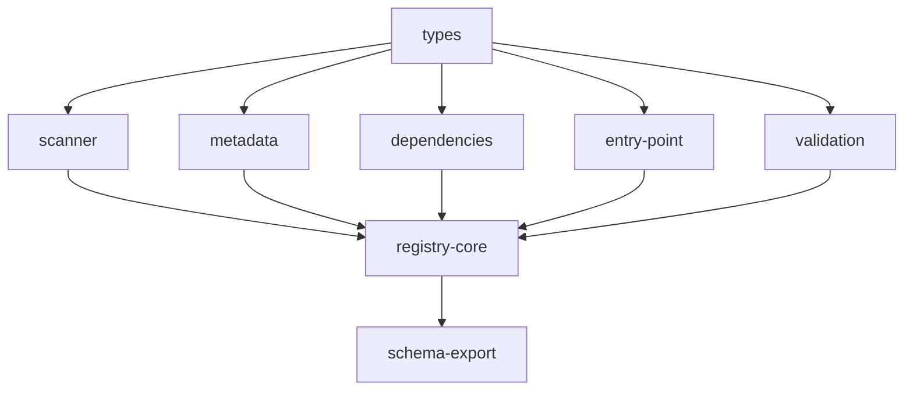

# Implementation Plan: Registry System

## Goal

Implement the module discovery and registration backbone for apcore, providing recursive directory scanning for `.ts`/`.js` extension files, YAML metadata loading with code-level merging, dependency resolution via Kahn's topological sort, dynamic module loading via async `import()`, structural validation, and a central `Registry` class that orchestrates the full 8-step discovery pipeline and exposes query, event, and schema export APIs.

## Architecture Design

### Component Structure

- **Types** (`registry/types.ts`, ~30 lines) -- Core interfaces: `ModuleDescriptor` (full module definition with schemas, tags, annotations, examples), `DiscoveredModule` (file path, canonical ID, meta path, namespace), and `DependencyInfo` (module ID, version, optional flag). Imports `ModuleAnnotations` and `ModuleExample` from the shared `module.ts` types.

- **Scanner** (`registry/scanner.ts`, ~140 lines) -- `scanExtensions()` recursively walks a single directory tree collecting `.ts`/`.js` files, skipping `.d.ts`, `.test.ts`, `.test.js`, `.spec.ts`, `.spec.js`, dot-prefixed entries, underscore-prefixed entries, and `node_modules`/`__pycache__` directories. Builds canonical IDs from relative paths using dot notation. Detects case collisions. Supports configurable `maxDepth` and `followSymlinks`. `scanMultiRoot()` delegates to `scanExtensions()` per root, prepending namespace prefixes and enforcing namespace uniqueness. **Known bug**: symlink detection uses `statSync` instead of `lstatSync`, so `stat.isSymbolicLink()` always returns false after stat follows the link.

- **Metadata** (`registry/metadata.ts`, ~105 lines) -- `loadMetadata()` reads and parses a YAML `_meta.yaml` file into a record. `parseDependencies()` converts raw dependency arrays into typed `DependencyInfo[]`. `mergeModuleMetadata()` merges code-level properties with YAML overrides (YAML wins for description, name, tags, version, annotations, examples, documentation; metadata records are shallow-merged). `loadIdMap()` loads a YAML ID map file with a `mappings` list for canonical ID overrides.

- **Dependencies** (`registry/dependencies.ts`, ~100 lines) -- `resolveDependencies()` implements Kahn's topological sort. Builds an adjacency graph and in-degree map from module dependency lists. Processes zero-in-degree nodes in sorted order for deterministic output. Throws `ModuleLoadError` for missing required dependencies and `CircularDependencyError` with an extracted cycle path when not all modules can be ordered. `extractCycle()` traces the first reachable cycle from remaining nodes.

- **Entry Point** (`registry/entry-point.ts`, ~65 lines) -- `resolveEntryPoint()` uses async `import()` to dynamically load a `.ts`/`.js` file, then resolves the module object. Priority: (1) metadata `entry_point` class name override, (2) default export if it passes `isModuleClass()`, (3) single named export passing `isModuleClass()`. Throws `ModuleLoadError` on import failure, missing class, no candidates, or ambiguous multiple candidates. `snakeToPascal()` utility converts snake_case to PascalCase. `isModuleClass()` duck-types by checking for inputSchema (object), outputSchema (object), description (string), and execute (function).

- **Validation** (`registry/validation.ts`, ~40 lines) -- `validateModule()` performs duck-type structural validation. Checks for: inputSchema (must be a non-null object, checked on instance and constructor), outputSchema (same), description (non-empty string), and execute (function). Returns an array of error strings; empty array means valid.

- **Registry** (`registry/registry.ts`, ~315 lines) -- Central `Registry` class. Constructor accepts optional `config`, `extensionsDir`, `extensionsDirs` (mutually exclusive), and `idMapPath`. Maintains `_modules` (Map of module ID to module object), `_moduleMeta` (Map of merged metadata), `_callbacks` (Map of event name to callback arrays), `_idMap` (canonical ID overrides), and `_schemaCache`. Exposes: `discover()` (async, returns count), `register()`, `unregister()`, `get()`, `has()`, `list()` (with tag/prefix filtering), `iter()`, `count` (getter), `moduleIds` (getter), `getDefinition()`, `on()`, `clearCache()`. Lifecycle hooks: calls `onLoad()` during registration and `onUnload()` during unregistration.

- **Schema Export** (`registry/schema-export.ts`, ~180 lines) -- `getSchema()` extracts a schema record from a registered module. `exportSchema()` serializes with optional strict mode (`toStrictSchema()`), compact mode (truncated descriptions, stripped extensions), or LLM export profile (MCP, OpenAI, Anthropic, Generic). `getAllSchemas()` and `exportAllSchemas()` operate on all registered modules. `serialize()` outputs JSON or YAML format.

### Data Flow

The 8-step `discover()` pipeline processes modules in this order:

1. **Scan Extension Roots** -- `scanExtensions()` or `scanMultiRoot()` depending on root configuration, producing `DiscoveredModule[]` with file paths, canonical IDs, and meta paths
2. **Apply ID Map Overrides** -- If an ID map was loaded, override canonical IDs for matching relative file paths
3. **Load Metadata** -- For each discovered module with a `_meta.yaml` companion, `loadMetadata()` parses the YAML into a metadata record
4. **Resolve Entry Points** -- `resolveEntryPoint()` uses async `import()` to load each file and resolve the module object (default export, named export, or metadata-specified class)
5. **Validate Modules** -- `validateModule()` checks structural requirements; invalid modules are silently dropped
6. **Collect Dependencies** -- `parseDependencies()` extracts `DependencyInfo[]` from each module's metadata
7. **Resolve Dependency Order** -- `resolveDependencies()` applies Kahn's topological sort, detecting cycles and missing required dependencies
8. **Register in Order** -- Modules are registered in dependency order, merged metadata is stored, `onLoad()` is called, and register event callbacks fire

### Technical Choices and Rationale

- **Async `import()` vs Python's `importlib`**: TypeScript/Node.js uses native ES module dynamic `import()` which is inherently async, unlike Python's synchronous `importlib.import_module()`. This makes `discover()` an async method returning `Promise<number>`, whereas the Python equivalent is synchronous.
- **No thread locking**: Node.js runs on a single-threaded event loop, eliminating the need for Python's `threading.Lock()` around registry mutations. The `_modules` Map is safely accessed without synchronization.
- **`statSync` instead of `lstatSync`**: The scanner uses `statSync` which follows symlinks before checking `isSymbolicLink()`, making the symlink check always return false. This is a known bug carried from the initial implementation. The fix would be to use `lstatSync` for the symlink check.
- **TypeBox schemas as JSON Schema**: Module `inputSchema` and `outputSchema` are TypeBox `TSchema` objects, which are already valid JSON Schema. No conversion step is needed for schema export, unlike Python's Pydantic models which require `.model_json_schema()`.
- **Deterministic sort in Kahn's algorithm**: Zero-in-degree nodes and dependents are processed in sorted order to ensure deterministic load ordering across runs.
- **Duck-type validation**: Instead of Python's class hierarchy checks (`issubclass`), TypeScript validation uses duck typing -- checking for the presence and types of `inputSchema`, `outputSchema`, `description`, and `execute` properties.

## Task Breakdown

| Task ID | Title | Estimated Time | Dependencies |
|---------|-------|---------------|--------------|
| types | ModuleDescriptor, DiscoveredModule, DependencyInfo interfaces | 1h | none |
| scanner | scanExtensions(), scanMultiRoot() directory scanning | 3h | types |
| metadata | loadMetadata(), mergeModuleMetadata(), loadIdMap(), parseDependencies() | 2h | types |
| dependencies | resolveDependencies() Kahn's topological sort | 3h | types |
| entry-point | resolveEntryPoint() with async import() | 2h | types |
| validation | validateModule() structural checks | 1h | types |
| registry-core | Registry class with 8-step discover() and query methods | 5h | scanner, metadata, dependencies, entry-point, validation |
| schema-export | getSchema(), exportSchema(), getAllSchemas(), exportAllSchemas() | 3h | registry-core |

## Risks and Considerations

- **Symlink detection bug**: `statSync` follows symlinks before `isSymbolicLink()` is called, so the symlink guard in the scanner never triggers. Symlink cycles could cause infinite recursion up to `maxDepth`. The fix is to use `lstatSync` for the initial stat call.
- **Silent module drop on import failure**: If `resolveEntryPoint()` throws during `discover()`, the module is silently skipped with `continue`. This could hide genuine configuration or code errors. Consider adding a logging callback or accumulating warnings.
- **Case-insensitive filesystem collisions**: The scanner detects case collisions in canonical IDs but does not prevent registration. On case-insensitive filesystems (macOS default), this could lead to unexpected behavior.
- **`onLoad` failure during discover**: If a module's `onLoad()` throws during step 8, the module is removed from the registry but no error is propagated. This is intentional for resilience but could mask setup failures.
- **Schema cache invalidation**: `clearCache()` only clears the schema cache; it does not affect `_modules` or `_moduleMeta`. Re-running `discover()` will add modules but not remove previously registered ones.

## Acceptance Criteria

- [x] `ModuleDescriptor`, `DiscoveredModule`, `DependencyInfo` interfaces compile with strict TypeScript
- [x] `scanExtensions()` discovers `.ts`/`.js` files, skips `.d.ts`, test files, dot/underscore prefixed, and `node_modules`
- [x] `scanMultiRoot()` enforces unique namespaces and prepends namespace to canonical IDs
- [x] `loadMetadata()` parses YAML `_meta.yaml` files; returns `{}` for missing files
- [x] `mergeModuleMetadata()` merges code and YAML metadata with YAML taking precedence
- [x] `loadIdMap()` loads YAML ID map with `mappings` list; throws on invalid format
- [x] `parseDependencies()` converts raw dependency arrays to typed `DependencyInfo[]`
- [x] `resolveDependencies()` produces correct topological order and detects cycles
- [x] `resolveEntryPoint()` resolves default exports, single named exports, and metadata-specified classes
- [x] `validateModule()` returns empty array for valid modules and descriptive errors for invalid ones
- [x] `Registry.discover()` executes all 8 pipeline steps and returns registered count
- [x] `Registry.register()`/`unregister()` manage modules with lifecycle hooks and event callbacks
- [x] `Registry.get()`, `has()`, `list()`, `iter()`, `count`, `moduleIds` provide correct query results
- [x] `getSchema()`/`exportSchema()` produce correct JSON/YAML with strict and compact modes
- [x] `getAllSchemas()`/`exportAllSchemas()` operate across all registered modules
- [x] All tests pass with `vitest`; zero errors from `tsc --noEmit`

## References

- `src/registry/types.ts` -- Core type interfaces
- `src/registry/scanner.ts` -- Directory scanning
- `src/registry/metadata.ts` -- Metadata loading and merging
- `src/registry/dependencies.ts` -- Dependency resolution
- `src/registry/entry-point.ts` -- Dynamic module loading
- `src/registry/validation.ts` -- Module structural validation
- `src/registry/registry.ts` -- Central Registry class
- `src/registry/schema-export.ts` -- Schema query and export
- `src/registry/index.ts` -- Public API re-exports
