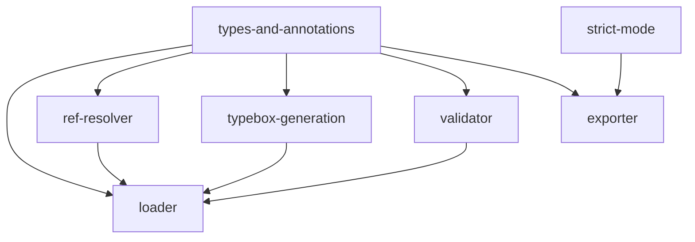

# Implementation Plan: Schema System

## Goal

Implement the complete schema infrastructure for apcore: YAML-based schema loading with `$ref` resolution, recursive conversion from JSON Schema to TypeBox `TSchema` objects, runtime validation with coercion support, annotation merging between YAML and code metadata, strict-mode transformations for LLM provider compatibility, and multi-format export targeting MCP, OpenAI, Anthropic, and Generic consumers.

## Architecture Design

### Component Structure

- **Types and Interfaces** (`schema/types.ts`, ~74 lines) -- Core type definitions for the schema system. Defines `SchemaStrategy` enum (`YamlFirst`, `NativeFirst`, `YamlOnly`), `ExportProfile` enum (`MCP`, `OpenAI`, `Anthropic`, `Generic`), `SchemaDefinition` interface (moduleId, description, inputSchema, outputSchema, errorSchema, definitions, version, documentation, schemaUrl), `ResolvedSchema` interface (jsonSchema, schema TSchema, moduleId, direction), `SchemaValidationErrorDetail` and `SchemaValidationResult` interfaces, `LLMExtensions` interface, and `validationResultToError()` converter.

- **Annotations** (`schema/annotations.ts`, ~67 lines) -- Conflict resolution layer for merging YAML-defined and code-defined module metadata. Exposes `mergeAnnotations()` (boolean annotation fields with YAML-wins precedence), `mergeExamples()` (YAML examples override code examples), and `mergeMetadata()` (shallow merge with YAML overrides). Consumes `ModuleAnnotations` and `ModuleExample` types from `module.ts`.

- **SchemaLoader** (`schema/loader.ts`, ~271 lines) -- Primary entry point for the schema system. Manages YAML file loading via `js-yaml`, two-level caching (`_schemaCache` for raw definitions, `_modelCache` for resolved TypeBox pairs), strategy-based schema selection (`getSchema()` with `YamlFirst`/`NativeFirst`/`YamlOnly` behavior), and `$ref` resolution delegation to `RefResolver`. Contains `jsonSchemaToTypeBox()` as an exported function for recursive JSON Schema to TypeBox conversion.

- **RefResolver** (`schema/ref-resolver.ts`, ~236 lines) -- `$ref` resolution engine following Algorithm A05. Supports local JSON pointers (`#/definitions/Foo`), relative file paths (`../shared.schema.yaml#/definitions/Bar`), `apcore://` canonical URIs (`apcore://module.id/definitions/Type`), and inline sentinel for self-referencing schemas. Implements circular reference detection via visited-set tracking and configurable max depth (default 32). Caches loaded files in `_fileCache`.

- **SchemaValidator** (`schema/validator.ts`, ~83 lines) -- Runtime validation using TypeBox `Value.Check()`, `Value.Decode()`, and `Value.Errors()`. Constructor accepts `coerceTypes` boolean (default `true`). When coercion is enabled, uses `Value.Decode()` for type coercion; when disabled, uses strict `Value.Check()`. Exposes `validate()` (returns `SchemaValidationResult`), `validateInput()` and `validateOutput()` (return data or throw `SchemaValidationError`). Error details include JSON path, message, constraint type, expected schema, and actual value.

- **SchemaExporter** (`schema/exporter.ts`, ~94 lines) -- Multi-format schema export for LLM provider integration. Dispatches on `ExportProfile` enum to four export methods: `exportMcp()` (MCP tool format with `readOnlyHint`/`destructiveHint`/`idempotentHint`/`openWorldHint` annotations), `exportOpenai()` (OpenAI function calling with strict mode, `additionalProperties: false`, all-required, LLM descriptions applied), `exportAnthropic()` (Anthropic tool use with `input_schema`, LLM descriptions, extensions stripped, optional `input_examples`), `exportGeneric()` (passthrough with raw input/output schemas and definitions).

- **Strict Mode** (`schema/strict.ts`, ~129 lines) -- Schema transformation utilities for OpenAI strict-mode compliance (Algorithm A23). `toStrictSchema()` deep-copies, strips extensions, then applies strict conversion. `stripExtensions()` recursively removes all `x-` prefixed keys and `default` values. `applyLlmDescriptions()` replaces `description` with `x-llm-description` where both exist. Internal `convertToStrict()` sets `additionalProperties: false`, promotes all properties to required, and wraps optional properties with `null` union types.

- **Barrel Export** (`schema/index.ts`, ~15 lines) -- Re-exports all public types, classes, and functions from the schema module.

### Data Flow

The schema system processes module schemas through this pipeline:

1. **YAML Loading** -- `SchemaLoader.load()` reads `{moduleId}.schema.yaml` from disk, parses with `js-yaml`, extracts required fields (`input_schema`, `output_schema`, `description`), merges `definitions`/`$defs`, and caches the `SchemaDefinition`
2. **Ref Resolution** -- `SchemaLoader.resolve()` delegates to `RefResolver.resolve()` which deep-copies the schema and recursively walks all nodes, resolving `$ref` pointers in-place with circular detection
3. **TypeBox Generation** -- `jsonSchemaToTypeBox()` recursively converts the resolved JSON Schema dictionary to TypeBox `TSchema` objects (`Type.Object`, `Type.Array`, `Type.String`, `Type.Integer`, `Type.Number`, `Type.Boolean`, `Type.Null`, `Type.Union`, `Type.Intersect`, `Type.Literal`, `Type.Record`, `Type.Unknown`)
4. **Strategy Selection** -- `SchemaLoader.getSchema()` applies the configured `SchemaStrategy` to choose between YAML-loaded and native (code-provided) TypeBox schemas, with fallback behavior per strategy
5. **Validation** -- `SchemaValidator.validate()` checks runtime data against TypeBox schemas using `Value.Check()` (strict) or `Value.Decode()` (coercion), collecting errors via `Value.Errors()`
6. **Export** -- `SchemaExporter.export()` transforms the `SchemaDefinition` to the target `ExportProfile` format, applying strict-mode transformations (OpenAI), LLM description substitution (OpenAI, Anthropic), extension stripping (Anthropic), and annotation mapping (MCP)

### Technical Choices and Rationale

- **TypeBox instead of Pydantic**: The Python apcore uses Pydantic for schema validation and `create_model()` for dynamic model generation. In TypeScript, TypeBox provides the same JSON Schema-based validation through `Value.Check()`/`Value.Decode()` with full TypeScript type inference. TypeBox schemas ARE valid JSON Schema objects, which eliminates a separate conversion layer and simplifies the `jsonSchemaToTypeBox()` function to a thin wrapper that produces TypeBox-tagged objects.

- **`jsonSchemaToTypeBox()` instead of `create_model()`**: Pydantic's `create_model()` dynamically generates Python classes at runtime. The TypeScript equivalent maps JSON Schema types to TypeBox builder calls (`Type.Object`, `Type.String`, etc.) which return plain objects with a `[Kind]` symbol tag. This is cheaper than class instantiation and integrates naturally with TypeBox's `Value.*` validation functions.

- **`js-yaml` for YAML parsing**: Standard YAML parsing library for Node.js. Used with `yaml.load()` for single-document loading. Synchronous file I/O via `readFileSync` is acceptable since schema loading is a startup-time operation.

- **Two-level caching in SchemaLoader**: Separate caches for `SchemaDefinition` (raw YAML parse result) and `[ResolvedSchema, ResolvedSchema]` (resolved TypeBox pair) avoid redundant `$ref` resolution and TypeBox conversion on repeated lookups while allowing cache invalidation at each level independently.

- **In-place mutation for `$ref` resolution**: The `RefResolver` deep-copies the schema first, then mutates in-place during resolution. This avoids creating intermediate copies at each `$ref` node while preserving the original schema. The visited-set tracking uses a fresh `Set` per `$ref` chain to allow the same definition to be referenced from multiple locations without false circular-detection positives.

- **`JSON.parse(JSON.stringify())` for deep copy**: Used in `RefResolver` and `strict.ts` for deep cloning JSON-compatible schema objects. Suitable because schemas are always JSON-serializable (no functions, symbols, or circular references in the input).

## Task Breakdown

| Task ID | Title | Estimated Time | Dependencies |
|---------|-------|---------------|--------------|
| types-and-annotations | Core interfaces, enums, and annotation merging | 2h | none |
| loader | SchemaLoader with YAML loading, caching, strategy | 4h | types-and-annotations, ref-resolver, typebox-generation |
| ref-resolver | RefResolver with $ref resolution and circular detection | 3h | types-and-annotations |
| typebox-generation | jsonSchemaToTypeBox() recursive converter | 3h | types-and-annotations |
| validator | SchemaValidator with TypeBox validation and coercion | 2h | types-and-annotations |
| exporter | SchemaExporter with 4 export profiles | 3h | types-and-annotations, strict-mode |
| strict-mode | toStrictSchema(), stripExtensions(), applyLlmDescriptions() | 2h | none |

## Risks and Considerations

- **TypeBox version compatibility**: The `Value.Decode()` API changed between TypeBox 0.32 and 0.34. The implementation targets `>= 0.34.0` where `Value.Decode()` performs coercion and returns the decoded value. Pinning the minimum version is essential.

- **JSON Schema coverage gaps**: `jsonSchemaToTypeBox()` handles the most common JSON Schema constructs (`object`, `array`, `string`, `integer`, `number`, `boolean`, `null`, `enum`, `oneOf`, `anyOf`, `allOf`) but does not cover `if/then/else`, `not`, `patternProperties`, or `$dynamicRef`. Unsupported constructs fall through to `Type.Unknown()`.

- **Synchronous file I/O**: `SchemaLoader` and `RefResolver` use `readFileSync` for YAML loading. This is acceptable for startup-time schema loading but would block the event loop if called during request handling. Future versions may need async variants.

- **Strict-mode `null` wrapping**: `convertToStrict()` wraps optional properties with `[type, "null"]` arrays or `{ oneOf: [schema, { type: "null" }] }`. This matches OpenAI's strict mode requirements but may confuse validators that do not support type arrays.

- **`apcore://` URI resolution**: The canonical URI scheme (`apcore://module.id/definitions/Type`) converts dots to path separators and appends `.schema.yaml`. This convention must be documented and consistently used across all schema files.

## Acceptance Criteria

- [x] `SchemaDefinition`, `ResolvedSchema`, `SchemaStrategy`, `ExportProfile` types are defined and exported
- [x] `SchemaLoader.load()` reads YAML files, validates required fields, and caches results
- [x] `SchemaLoader.getSchema()` applies `YamlFirst`/`NativeFirst`/`YamlOnly` strategy correctly
- [x] `RefResolver.resolve()` handles local pointers, relative files, `apcore://` URIs, and nested `$ref` chains
- [x] `RefResolver` detects circular references and raises `SchemaCircularRefError`
- [x] `RefResolver` enforces max depth and raises on exceeded depth
- [x] `jsonSchemaToTypeBox()` converts all supported JSON Schema types to TypeBox equivalents
- [x] `jsonSchemaToTypeBox()` passes through constraint options (`minLength`, `maximum`, etc.)
- [x] `SchemaValidator.validate()` returns `SchemaValidationResult` with detailed error paths
- [x] `SchemaValidator` supports coercion mode (`Value.Decode`) and strict mode (`Value.Check`)
- [x] `SchemaExporter` produces correct MCP, OpenAI, Anthropic, and Generic export formats
- [x] `toStrictSchema()` sets `additionalProperties: false`, makes all properties required, wraps optionals with null
- [x] `stripExtensions()` removes all `x-` keys and `default` values recursively
- [x] `applyLlmDescriptions()` replaces `description` with `x-llm-description` where present
- [x] `mergeAnnotations()`, `mergeExamples()`, `mergeMetadata()` merge YAML/code metadata with correct precedence
- [x] All tests pass with `vitest`; zero errors from `tsc --noEmit`

## References

- `src/schema/types.ts` -- Type definitions and enums
- `src/schema/annotations.ts` -- Annotation conflict resolution
- `src/schema/loader.ts` -- SchemaLoader and jsonSchemaToTypeBox()
- `src/schema/ref-resolver.ts` -- RefResolver
- `src/schema/validator.ts` -- SchemaValidator
- `src/schema/exporter.ts` -- SchemaExporter
- `src/schema/strict.ts` -- Strict-mode utilities
- `src/schema/index.ts` -- Barrel export
- `tests/schema/test-loader.test.ts` -- Loader and TypeBox generation tests
- `tests/schema/test-validator.test.ts` -- Validator tests
- `tests/schema/test-ref-resolver.test.ts` -- RefResolver tests
- `tests/schema/test-strict.test.ts` -- Strict-mode tests
